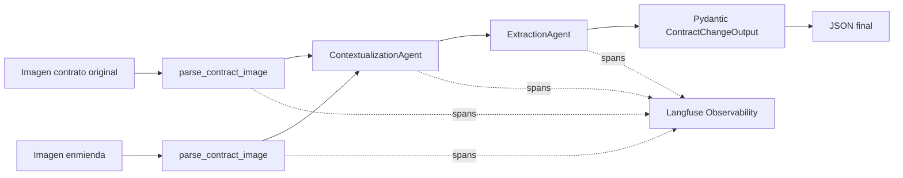
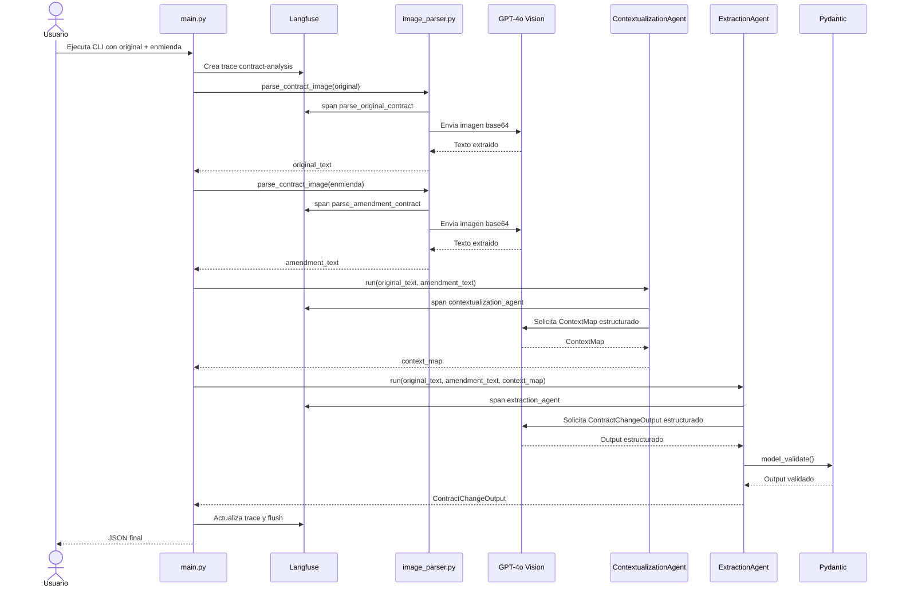

# LegalMove - Agente Autonomo de Comparacion de Contratos

Pipeline en Python que compara la imagen de un contrato original contra la imagen de su enmienda. El sistema usa GPT-4o Vision para extraer el texto, un agente para contextualizar la estructura del documento, otro para identificar los cambios y Pydantic para validar la salida final.

## Indice

- [Objetivo](#objetivo)
- [Arquitectura](#arquitectura)
- [Diagrama de secuencia](#diagrama-de-secuencia)
- [Estructura del repositorio](#estructura-del-repositorio)
- [Requisitos](#requisitos)
- [Instalacion](#instalacion)
- [Uso](#uso)
- [Salida esperada](#salida-esperada)
- [Decisiones tecnicas](#decisiones-tecnicas)
- [Observabilidad con Langfuse](#observabilidad-con-langfuse)
- [Limitaciones actuales](#limitaciones-actuales)
- [Propuesta de escalado](#propuesta-de-escalado)
- [Tests](#tests)

## Objetivo

El objetivo del proyecto es automatizar la comparacion entre un contrato original y su enmienda a partir de imagenes escaneadas:

- `parse_contract_image()` usa GPT-4o Vision sobre imagenes en base64.
- `ContextualizationAgent` construye un mapa estructural del documento.
- `ExtractionAgent` usa ese mapa para extraer cambios contractuales.
- `ContractChangeOutput` valida la salida final.
- Langfuse registra una traza raiz y spans hijos por etapa.

## Arquitectura

Este diagrama resume la arquitectura lógica del sistema: dos entradas visuales pasan por el parser multimodal, luego por dos agentes con responsabilidades separadas y finalmente por una validación estricta antes de producir el JSON final.



Resumen de entradas y salidas por componente:

| Componente | Entrada | Salida |
|---|---|---|
| `parse_contract_image` | Imagen contractual | Texto extraido |
| `ContextualizationAgent` | Texto original + texto de enmienda | `context_map` |
| `ExtractionAgent` | Texto original + texto de enmienda + `context_map` | `ContractChangeOutput` |
| `Pydantic ContractChangeOutput` | JSON estructurado del extractor | Output validado |
| `Langfuse` | Eventos del pipeline | Trazas, spans y metricas |

## Diagrama de secuencia

Este diagrama muestra el orden real de ejecución del pipeline, incluyendo la creación de la traza en Langfuse, las llamadas a GPT-4o y la validación final con Pydantic.



El handoff entre agentes sigue una separación estricta de responsabilidades. `ContextualizationAgent` no decide qué cambió: solo construye un mapa estructural confiable del contrato y la enmienda. `ExtractionAgent` usa ese mapa como guía, pero compara sobre los textos completos para identificar cambios concretos y devolver un resultado validado. Esa división reduce alucinaciones y hace más defendible el diseño en la presentación.

## Estructura del repositorio

```text
aem4/
├── .coveragerc
├── .env.example
├── README.md
├── requirements.txt
├── src/
│   ├── main.py
│   ├── image_parser.py
│   ├── models.py
│   └── agents/
│       ├── __init__.py
│       ├── contextualization_agent.py
│       └── extraction_agent.py
├── data/test_contracts/
├── tests/
│   └── test_models.py
└── .gitignore
```

## Requisitos

- Python 3.10 o superior
- Una cuenta con claves de OpenAI y Langfuse

## Instalacion

```bash
python -m venv .venv
source .venv/bin/activate
pip install -r requirements.txt
cp .env.example .env
```

`.env.example`:

```env
OPENAI_API_KEY=your-key-here
LANGFUSE_PUBLIC_KEY=pk-lf-xxx
LANGFUSE_SECRET_KEY=sk-lf-xxx
LANGFUSE_HOST=https://cloud.langfuse.com
```

## Uso

Salida JSON estructurada por defecto:

```bash
python -m src.main data/test_contracts/documento_1__original.jpg data/test_contracts/documento_1__enmienda.jpg
```

Salida legible para humanos:

```bash
python -m src.main data/test_contracts/documento_1__original.jpg data/test_contracts/documento_1__enmienda.jpg --pretty
```

## Salida esperada

```json
{
  "sections_changed": [
    "Cláusula 2",
    "Cláusula 7"
  ],
  "topics_touched": [
    "Plazo",
    "Protección de datos"
  ],
  "summary_of_the_change": "La Cláusula 2 modifica el plazo contractual de 12 a 24 meses y la Cláusula 7 incorpora obligaciones específicas de protección de datos."
}
```

### Schema del output

| Campo | Tipo | Requerido | Restricciones |
|---|---|---|---|
| `sections_changed` | `list[str]` | Si | Lista vacia si no hay cambios. Usa identificadores exactos del documento, por ejemplo `"Cláusula 3"` o `"Sección 2.1"`. |
| `topics_touched` | `list[str]` | Si | Lista vacia si no hay cambios. Representa categorias legales o comerciales afectadas. |
| `summary_of_the_change` | `str` | Si | Minimo 50 caracteres. Debe referenciar secciones especificas e indicar el cambio detectado. |

## Decisiones tecnicas

### Por que GPT-4o Vision para el parsing

El sistema trabaja sobre imagenes escaneadas de documentos contractuales. En este contexto no alcanza con extraer texto plano: tambien importa preservar numeracion, jerarquia de clausulas, terminos definidos y referencias cruzadas. Por eso se usa un modelo multimodal en lugar de un OCR basico. Ademas, el parsing se realiza con `detail: "high"` para mejorar la fidelidad sobre documentos densos en texto y con estructura jerarquica.

### Por que separar el analisis en dos agentes

Se dividio el flujo en dos responsabilidades. `ContextualizationAgent` se enfoca en entender el tipo de documento, sus partes y su estructura. `ExtractionAgent` usa ese contexto para identificar cambios concretos. Esta separacion reduce mezcla de tareas, mejora el handoff entre etapas y hace mas facil depurar resultados.

La separación de responsabilidades permite:

- Agente 1 (Analista): enfocarse en entender qué ES el documento, sin comparar.
- Agente 2 (Auditor): recibir un mapa ya construido y enfocarse exclusivamente en QUÉ cambió.

Este patrón reduce alucinaciones y mejora la exhaustividad de la extracción.

### Por que validar la salida con Pydantic

El output final no esta pensado solo para lectura humana. Debe ser consumible por otros sistemas, por lo que necesita un schema estable. Pydantic se usa para asegurar que la salida tenga forma conocida, tipos consistentes y fallos explicitos cuando el modelo devuelve algo incompleto o invalido.

### Por que usar Langfuse para observabilidad

El pipeline tiene varias etapas dependientes entre si y varias llamadas a modelos. Langfuse permite registrar una traza raiz y spans por etapa para inspeccionar inputs, outputs, latencia y uso de tokens. Eso facilita auditoria, debugging y analisis de costos.


### Manejo de errores y validacion defensiva

Los agentes pueden devolver salidas parciales o con formatos distintos segun la version de las librerias y el comportamiento del modelo. Por eso el pipeline revalida los resultados, tolera algunas variaciones controladas y falla de forma explicita cuando no puede garantizar una salida consistente.

En particular, se usan dos capas de validacion sobre la salida estructurada. `with_structured_output()` orienta al modelo a responder con el schema esperado, mientras que `model_validate()` vuelve a validar el resultado del lado de la aplicacion. Esta verificacion adicional permite detectar campos faltantes, tipos incorrectos o respuestas parcialmente parseadas antes de continuar el flujo.

### Por que el parsing de imagenes es secuencial y no paralelo

Las dos imagenes podrian procesarse en paralelo porque son independientes, pero hoy el pipeline prioriza simplicidad operativa y trazabilidad clara. Ejecutarlas de forma secuencial mantiene el flujo mas facil de seguir en logs y en Langfuse, reduce complejidad de coordinacion y evita introducir concurrencia antes de que sea realmente necesaria. Si el volumen o la latencia lo justificaran, esta etapa es una candidata natural para paralelizacion futura, por ejemplo usando `asyncio` para lanzar ambos parsings de manera concurrente.

## Observabilidad con Langfuse

Langfuse actua como el sistema de trazabilidad del pipeline: cada ejecucion genera una trace raiz (`contract-analysis`) que agrupa todas las etapas bajo un `trace_id` unico. De esa traza cuelgan spans hijos para el parsing del contrato original, el parsing de la enmienda, la contextualizacion y la extraccion. Esta estructura permite inspeccionar en el dashboard que entro a cada etapa, que devolvio y cuanto costo en tiempo y tokens.

### Spans registrados

Cada ejecucion crea una traza raiz `contract-analysis` con cuatro spans:

- `parse_original_contract`
- `parse_amendment_contract`
- `contextualization_agent`
- `extraction_agent`

Los spans registran la siguiente informacion:

- `input`
- `output`
- `latency_ms`
- tokens cuando la libreria los expone
- estado de validacion

Detalle por span:

- `parse_original_contract` y `parse_amendment_contract`: registran la imagen de entrada, el tamaño del archivo, el texto extraido y el consumo de tokens de la llamada a GPT-4o Vision.
- `contextualization_agent`: registra los textos de entrada, el mapa contextual resultante, el tipo de documento detectado, las partes identificadas y la cantidad de secciones mapeadas.
- `extraction_agent`: registra los textos de entrada, el `context_map`, la salida validada por Pydantic, la cantidad de secciones afectadas, los temas detectados y el estado de validacion.

### Metricas por span

- `latency_ms`
- `prompt_tokens`
- `completion_tokens`
- `total_tokens`
- `text_length`
- `sections_count`
- `topics_count`
- `validation_status`

### Flujo de instrumentacion

Cada etapa sigue el mismo patron: se abre un span antes de invocar al modelo, se ejecuta la llamada y luego se cierra el span con el output y la metadata resultantes. Al finalizar el pipeline, `langfuse.flush()` envia los eventos acumulados al servidor.

La instrumentacion actual es manual usando `trace.span(...)` y `span.end(...)`. No se promete callback tracing automatico de LangChain.

## Limitaciones actuales

| Limitacion | Detalle |
|---|---|
| Una pagina por imagen | Cada imagen debe contener una sola pagina. Documentos multipagina deben dividirse manualmente antes de procesar. |
| Solo 2 documentos | El pipeline compara exactamente un original y una enmienda. No soporta multiples enmiendas encadenadas en una sola ejecucion. |
| Formatos soportados | `.jpg`, `.jpeg`, `.png`, `.gif`, `.webp`. No se aceptan PDFs directamente. |
| Idioma | El sistema esta optimizado para contratos en español. Puede funcionar en otros idiomas, pero los prompts y validadores estan orientados al dominio legal hispanohablante. |
| Longitud maxima del texto | `ExtractionAgent` recibe ambos textos junto con el `context_map`. En documentos muy extensos, la suma de tokens puede acercarse al limite del modelo. |
| Texto ilegible | Si el parser detecta texto ilegible, lo marca como `[ILEGIBLE]`. El agente de extraccion intentara analizar el resto, pero puede omitir cambios en esas zonas. |
| Dependencia de calidad de escaneo | Imagenes con baja resolucion, sombras, recortes o rotacion pueden degradar el parsing y afectar la extraccion posterior. |
| Cobertura de tests | El proyecto tiene tests unitarios y coverage basico, pero no cuenta todavia con pruebas end-to-end ni mocks de OpenAI y Langfuse. |

## Propuesta de escalado

La arquitectura actual resuelve bien el caso base: un par de documentos, ejecucion local, procesamiento secuencial y salida JSON validada. Si el volumen o la complejidad documental crecieran, el camino natural de evolucion puede pensarse en los siguientes niveles.

### Punto de partida: escenario actual

Hoy el pipeline:

- procesa un par de documentos por ejecucion,
- corre en una sola maquina,
- ejecuta sus etapas en forma secuencial,
- y no incluye una API ni una cola de trabajos.

| Metrica | Estado actual |
|---|---|
| Unidad de procesamiento | 1 par de imagenes por ejecucion |
| Modo de ejecucion | Secuencial |
| Infraestructura | Python local |
| Persistencia | No incluida |
| Observabilidad | Langfuse con trace raiz y spans por etapa |

Este baseline es suficiente para desarrollo local y ejecuciones controladas. A partir de ahi, el escalado mas razonable seria incremental.

### Nivel 1 - Paralelizacion interna

Problema: las dos imagenes se parsean de forma secuencial aunque son independientes.

Propuesta: paralelizar solo la etapa de parsing y mantener igual el resto del pipeline. La opcion mas natural seria una variante asincronica usando `asyncio`, ya que ambas llamadas son I/O-bound y no dependen una de la otra.

Beneficios esperados:

- menor latencia total por ejecucion,
- cambios acotados sobre la arquitectura actual,
- y reaprovechamiento del pipeline existente desde contextualizacion en adelante.

Consideracion: esta mejora debe acompañarse con manejo de rate limits y reintentos para no degradar la estabilidad bajo concurrencia.

### Nivel 2 - API con cola de trabajos

Problema: cuando el volumen aumenta o hay varios usuarios, ejecutar el pipeline desde CLI deja de ser suficiente.

Propuesta: exponer el analisis como servicio y desacoplar recepcion de solicitudes de procesamiento real.

Arquitectura sugerida:

```text
Cliente -> API HTTP -> Cola de trabajos -> Workers -> Almacen de resultados
```

Componentes posibles:

| Componente | Opcion sugerida | Rol |
|---|---|---|
| API | FastAPI | Recibir solicitudes y validar entrada |
| Cola | Redis / RabbitMQ / SQS | Desacoplar productor y consumidor |
| Workers | Celery / RQ / procesos dedicados | Ejecutar `run_pipeline()` en paralelo |
| Resultados | PostgreSQL | Persistir estado y salida JSON |
| Archivos | S3 o almacenamiento equivalente | Evitar dependencia de paths locales |

Beneficios esperados:

- mayor throughput,
- soporte multiusuario,
- reintentos controlados,
- y mejor trazabilidad operativa.

### Nivel 3 - Soporte para documentos multipagina

Problema: el proyecto actual asume una imagen por documento, pero los contratos reales suelen tener multiples paginas.

Propuesta: agregar una etapa previa de particionado y ensamblado.

Flujo sugerido:

```text
PDF o TIFF -> dividir en paginas -> parsear cada pagina -> unir texto -> pipeline actual
```

Puntos clave:

- convertir cada pagina en imagen antes del parsing,
- preservar saltos de pagina o separadores estructurales,
- y evitar cortes arbitrarios en medio de una clausula.

Si el volumen de texto crece demasiado, una evolucion posterior seria hacer chunking por secciones o clausulas en vez de concatenar todo linealmente.

### Nivel 4 - Persistencia y auditoria historica

Problema: cuando se procesan muchos contratos, deja de alcanzar con devolver el JSON y descartarlo.

Propuesta: persistir resultados y metadata de ejecucion para consulta historica.

Capacidades a incorporar:

- historial de ejecuciones por contrato,
- filtros por `sections_changed`,
- filtros por `topics_touched`,
- registro de errores y fallos recurrentes,
- y almacenamiento del output validado junto con metadata operativa.

Esto transforma al pipeline en una base util para auditoria, reporting y seguimiento operativo.

### Nivel 5 - Optimizacion de costo y ruteo por complejidad

Problema: no todos los documentos requieren la misma estrategia de procesamiento.

Propuesta: incorporar una etapa previa que clasifique complejidad documental y enrute la ejecucion segun señales como:

- cantidad de paginas,
- longitud del texto extraido,
- presencia de tablas o baja legibilidad,
- y cantidad de secciones detectadas.

Con esa informacion, se podria:

- usar una estrategia mas economica para documentos simples,
- reservar la configuracion mas exigente para documentos complejos,
- o variar el modelo entre parsing, contextualizacion y extraccion.

### Resumen de hoja de ruta

| Nivel | Objetivo principal | Cambio dominante |
|---|---|---|
| 1 | Reducir latencia por ejecucion | Paralelizar parsings |
| 2 | Aumentar throughput | API + cola + workers |
| 3 | Soportar contratos largos | Multipagina + ensamblado |
| 4 | Mejorar trazabilidad historica | Persistencia y auditoria |
| 5 | Optimizar costo operativo | Ruteo por complejidad |

## Tests

La suite actual esta basada en `unittest` y cubre validaciones de los modelos Pydantic. Ademas, el proyecto incluye `coverage` para medir la cobertura sobre el codigo de `src/` usando la configuracion de [`.coveragerc`](/Users/mauroorias/Documents/henry/aem4/.coveragerc).

Ejecutar tests:

```bash
python -m unittest discover -s tests
```

Ejecutar tests con coverage:

```bash
coverage run -m unittest discover -s tests
coverage report -m
```

Generar reporte HTML de coverage:

```bash
coverage html
```

El reporte HTML se genera en `coverage_html/index.html`.
