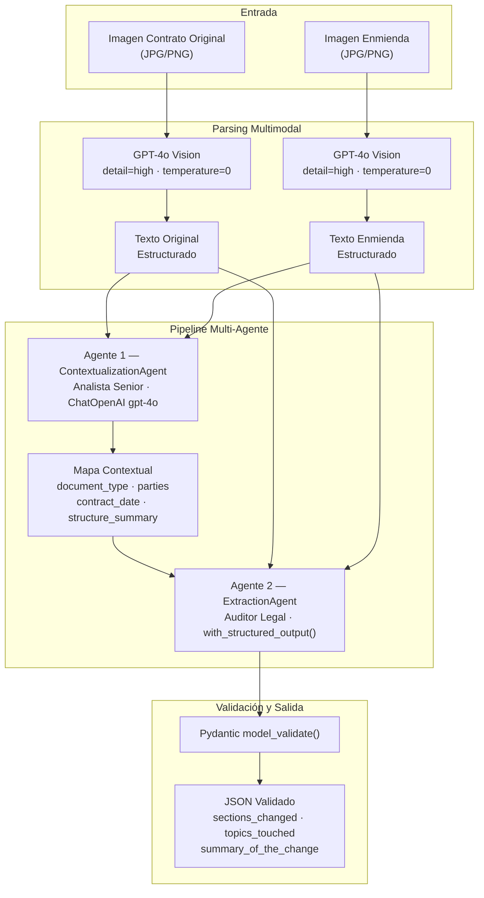
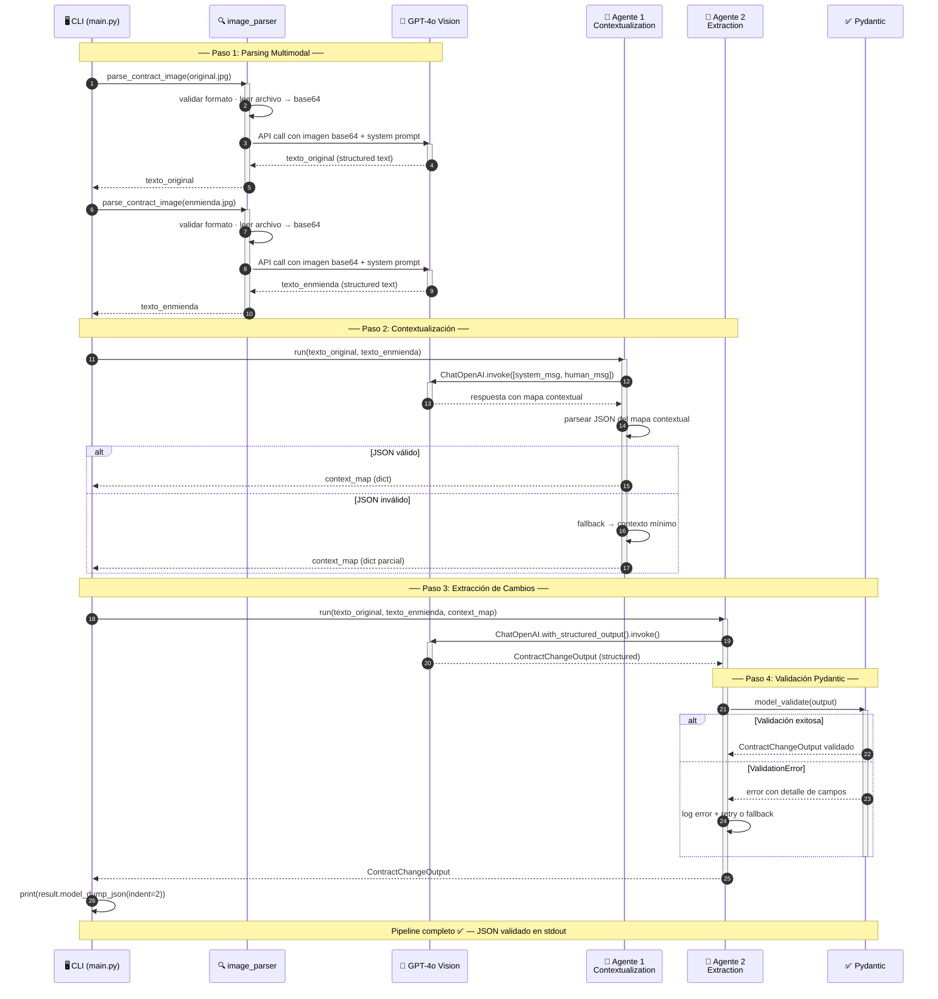
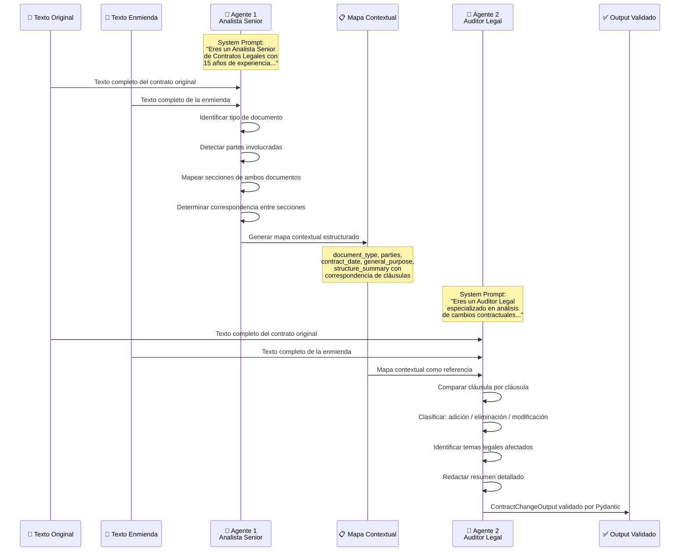
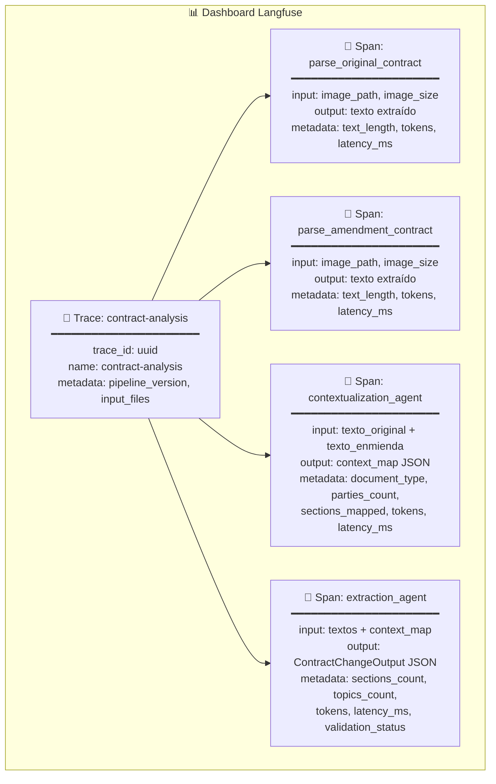
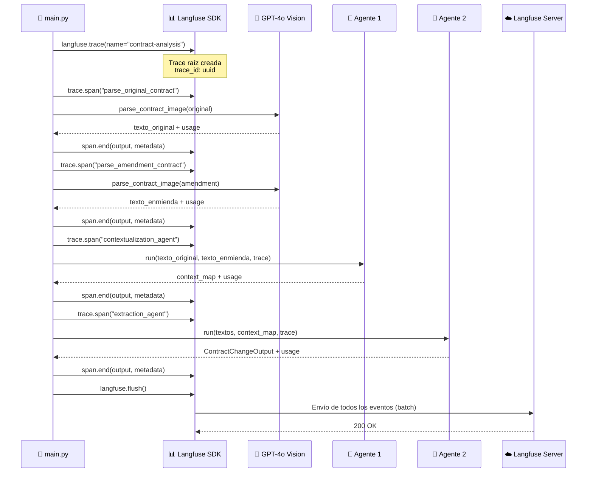

# LegalMove — Agente Autónomo de Comparación de Contratos

Sistema multi-agente que procesa imágenes escaneadas de contratos legales y sus enmiendas, extrae el texto mediante visión multimodal (GPT-4o) y produce un análisis estructurado y validado de todos los cambios introducidos.

---

## Arquitectura del sistema

El sistema opera en cuatro pasos secuenciales: las imágenes de entrada se convierten a texto mediante visión multimodal (GPT-4o), luego dos agentes LLM especializados procesan ese texto en pipeline — el primero construye un mapa contextual del documento y el segundo extrae los cambios usando ese mapa como referencia —, y el resultado se valida con Pydantic.



---

## Diagrama de secuencia

El siguiente diagrama muestra el flujo de mensajes entre los componentes del sistema durante una ejecución completa. Cada flecha representa una llamada real: desde que el CLI inicia los dos parsings de imagen hasta la contextualización, la extracción estructurada y la validación Pydantic. Los bloques `alt` indican los caminos alternativos ante respuestas inválidas del LLM.




## Estructura del proyecto

```
aem4/
├── src/
│   ├── main.py                          # Entry point del pipeline
│   ├── image_parser.py                  # Parsing multimodal GPT-4o Vision
│   ├── models.py                        # Schema Pydantic ContractChangeOutput
│   └── agents/
│       ├── __init__.py
│       ├── contextualization_agent.py   # Agente 1: contexto
│       └── extraction_agent.py          # Agente 2: extracción de cambios
├── data/
│   └── test_contracts/                  # 3 pares de imágenes de prueba
├── .env.example                         # Template de variables de entorno
├── requirements.txt
└── README.md
```

---

## Prerrequisitos

| Requisito | Versión mínima | Notas |
|---|---|---|
| Python | 3.10+ | Requerido por la sintaxis de type hints (`list[str]`) |
| pip | Cualquiera | Incluido con Python |
| Entorno virtual | — | Recomendado (`venv` o `conda`) |

No se requieren dependencias del sistema operativo. El parser de imágenes usa `base64` (built-in) y no depende de librerías nativas.

```bash
# Crear y activar entorno virtual (recomendado)
python -m venv .venv
source .venv/bin/activate  # Windows: .venv\Scripts\activate
```

---

## Setup

### 1. Instalar dependencias

```bash
pip install -r requirements.txt
```

### 2. Configurar variables de entorno

```bash
cp .env.example .env
```

Editar `.env` con las claves reales:

```env
OPENAI_API_KEY=sk-...          # API key de OpenAI
LANGFUSE_PUBLIC_KEY=pk-lf-...  # Clave pública de Langfuse
LANGFUSE_SECRET_KEY=sk-lf-...  # Clave secreta de Langfuse
LANGFUSE_HOST=https://cloud.langfuse.com
```

**Obtener claves Langfuse:**
1. Crear cuenta en https://cloud.langfuse.com
2. Crear un nuevo proyecto
3. En Settings → API Keys, copiar public key y secret key

> **Costo estimado por ejecución:** ~$0.05–$0.10 USD con GPT-4o (imágenes en `detail=high`). Ver la sección [Fundamentos del mecanismo de tokenización](#fundamentos-del-mecanismo-de-tokenización) para el desglose por etapa.

---

## Uso

```bash
python src/main.py <imagen_original> <imagen_enmienda>
```

**Formatos de imagen soportados:** `.jpg`, `.jpeg`, `.png`, `.gif`, `.webp`

> Cada imagen debe contener una sola página del contrato. El sistema no soporta PDFs ni documentos multipágina de forma nativa.

### Ejemplos con los contratos de prueba

**Par 1 — Cambio simple (Contrato de Licencia de Software):**
```bash
python src/main.py \
  data/test_contracts/documento_1__original.jpg \
  data/test_contracts/documento_1__enmienda.jpg
```
Cambios esperados: plazo 12→24 meses, tarifa anual, soporte ampliado, cláusula de protección de datos nueva.

**Par 2 — Cambios múltiples (Contrato de Servicios de Consultoría):**
```bash
python src/main.py \
  data/test_contracts/documento_2__original.jpg \
  data/test_contracts/documento_2__enmienda.jpg
```
Cambios esperados: duración 6→9 meses, honorarios $8.000→$9.500, entregables quincenales, propiedad intelectual nueva.

**Par 3 — Contrato SaaS:**
```bash
python src/main.py \
  data/test_contracts/documento_3__original.jpg \
  data/test_contracts/documento_3__enmienda.jpg
```
Cambios esperados: precio $1.200→$1.250, disponibilidad 99,5%→99,9%, soporte ampliado con sistema de tickets.

---

## Salida del sistema

```json
{
  "sections_changed": [
    "Cláusula 2 — Plazo",
    "Cláusula 3 — Pago",
    "Cláusula 4 — Soporte",
    "Cláusula 7 — Protección de Datos"
  ],
  "topics_touched": [
    "Plazo del contrato",
    "Honorarios y tarifas",
    "Soporte técnico",
    "Protección de datos personales"
  ],
  "summary_of_the_change": "La enmienda introduce cuatro modificaciones sobre el contrato original..."
}
```

### Schema del output

| Campo | Tipo | Requerido | Restricciones |
|---|---|---|---|
| `sections_changed` | `list[str]` | Sí | Al menos 1 elemento. Usa identificadores exactos del documento (ej. `"Cláusula 3"`, `"Sección 2.1"`). |
| `topics_touched` | `list[str]` | Sí | Al menos 1 elemento. Categorías legales o comerciales afectadas. |
| `summary_of_the_change` | `str` | Sí | Mínimo 50 caracteres. Debe referenciar secciones específicas e indicar valor anterior y nuevo. |

---

## Decisiones técnicas

### Por qué GPT-4o Vision
GPT-4o es el único modelo de OpenAI con soporte de visión de alta fidelidad para documentos densos en texto. Con `detail: "high"`, preserva numeración de cláusulas, términos definidos y estructura jerárquica — elementos críticos para el análisis legal. Se usa base64 en lugar de URLs para portabilidad y funcionamiento offline.

### Por qué 2 agentes separados
Un solo agente que contextualice y extraiga cambios al mismo tiempo degrada la calidad de ambas tareas. La separación de responsabilidades permite:
- **Agente 1 (Analista)**: enfocarse en entender qué ES el documento, sin comparar.
- **Agente 2 (Auditor)**: recibir un mapa ya construido y enfocarse exclusivamente en QUÉ cambió.

Este patrón reduce alucinaciones y mejora la exhaustividad de la extracción.

### Por qué Pydantic con with_structured_output()
`with_structured_output()` de LangChain pasa el schema Pydantic como definición de función al LLM, forzando una respuesta JSON conforme al schema antes de la deserialización. La validación explícita adicional con `model_validate()` agrega una segunda capa de seguridad. Los `field_validator` personalizan los mensajes de error para el dominio legal.

### Por qué Langfuse
Langfuse permite trazar la ejecución completa con jerarquía padre-hijo (trace → spans), capturando inputs, outputs, latencias y tokens por etapa. Esto es esencial en producción para:
- Debuggear qué etapa falló en una ejecución específica
- Auditar qué texto extrajo el parser y qué vio cada agente
- Monitorear costos por imagen procesada

---

## Interacción entre agentes (Handoff Pattern)

El pipeline utiliza un **Handoff Pattern** de dos etapas: el **Agente 1 (Analista Senior)** recibe ambos documentos y construye un mapa contextual estructurado — identificando tipo de documento, partes y correspondencia entre cláusulas — que luego pasa como contexto al **Agente 2 (Auditor Legal)**. Este, a su vez, compara el contrato original contra la enmienda cláusula por cláusula y genera un `ContractChangeOutput` validado por Pydantic. La separación estricta de responsabilidades evita que cada agente asuma tareas fuera de su especialidad, lo que reduce alucinaciones y aumenta la exhaustividad del análisis.



> El Agente 1 nunca extrae cambios — solo construye el contexto. El Agente 2 nunca analiza estructura — solo compara usando el mapa que recibió. Esta separación de responsabilidades reduce alucinaciones y mejora la exhaustividad de la extracción, ya que cada agente se enfoca exclusivamente en su tarea especializada.

---

## Observabilidad en Langfuse

Langfuse actúa como el sistema de trazabilidad del pipeline: cada ejecución genera una **Trace** raíz (`contract-analysis`) que agrupa todos los pasos bajo un `trace_id` único. De esa traza cuelgan cuatro **Spans** hijos, uno por cada etapa que invoca un LLM externo. Esta estructura permite reconstruir el razonamiento del sistema clic a clic en el dashboard: se puede abrir cualquier span y ver exactamente qué texto llegó al LLM y qué respondió, sin necesidad de logs adicionales.

### Jerarquía de trazas

Cada ejecución construye la siguiente jerarquía en el dashboard de Langfuse:



**Spans registrados:**

- **`parse_original_contract`** y **`parse_amendment_contract`**: corresponden a las dos llamadas a GPT-4o Vision. Cada span registra el path de la imagen de entrada, el tamaño del archivo, el texto extraído y los tokens consumidos.
- **`contextualization_agent`**: cubre la llamada del Agente 1. Se captura el JSON completo del mapa contextual resultante, el tipo de documento detectado, las partes identificadas y el número de secciones mapeadas.
- **`extraction_agent`**: cubre la llamada del Agente 2. Se registra el `ContractChangeOutput` validado por Pydantic, el número de cambios detectados, los temas legales afectados y el estado de la validación del schema.

**Métricas disponibles por span:**
- `latency_ms`: tiempo de respuesta de cada llamada
- `prompt_tokens` / `completion_tokens`: costo de cada etapa
- `text_length`: longitud del texto extraído por el parser
- `sections_count`: número de cambios detectados por el auditor

### Flujo de instrumentación

Cada etapa sigue el mismo patrón: se abre un span antes de llamar al LLM, se ejecuta la llamada, y se cierra el span con el output y la metadata resultantes. Al final, `langfuse.flush()` envía todos los eventos acumulados en el buffer local al servidor en un único batch.



### Detalles de implementación

La integración con Langfuse se realizó de forma explícita y manual (sin auto-instrumentación) para tener control total sobre qué se registra en cada etapa. Los puntos clave son:

**1. Apertura y cierre explícito de spans**

Cada span se abre antes de la llamada al LLM y se cierra inmediatamente después, capturando el `output` real y la `latency_ms` calculada con `time.time()`:

```python
span = trace.span(name="parse_original_contract", input={"image_path": str(image_path)})
start = time.time()
result = parse_contract_image(image_path, client)
span.end(
    output={"extracted_text": result},
    metadata={"text_length": len(result), "latency_ms": round((time.time() - start) * 1000)}
)
```

**2. Metadata semántica por etapa**

Cada span incluye metadata específica del dominio, no solo datos técnicos. Por ejemplo, el span de `contextualization_agent` registra `document_type` y `sections_mapped`; el de `extraction_agent` registra `sections_count` y `validation_status`. Esto permite filtrar trazas en Langfuse por criterios de negocio, no solo por latencia o errores.

**3. Flush garantizado al final del pipeline**

La llamada `langfuse.flush()` al final de `main.py` asegura que todos los eventos se envíen al servidor antes de que el proceso termine, evitando pérdida de trazas en ejecuciones cortas donde el buffer no llega a vaciarse automáticamente.

**4. Propagación de la traza a los agentes**

El objeto `trace` se pasa como parámetro a cada agente (`contextualization_agent.run(... trace=trace)`), lo que permite que los spans hijos queden asociados a la misma traza raíz. Sin esta propagación, cada llamada generaría una traza independiente y se perdería la visión del pipeline completo.

**5. Captura de tokens por etapa**

Los `prompt_tokens` y `completion_tokens` se registran en el metadata de cada span a partir de la respuesta del API de OpenAI (`response.usage`). Esto habilita el cálculo de costo exacto por ejecución directamente desde el dashboard de Langfuse, sin necesidad de instrumentar la facturación por separado.


---

## Fundamentos del mecanismo de tokenización

### ¿Qué es un token?

Un token es la unidad mínima de procesamiento que el LLM "lee" y "escribe". No equivale a una palabra ni a un carácter; es una secuencia de caracteres frecuentes en el corpus de entrenamiento. GPT-4o usa el tokenizador **o200k_base** (tiktoken), que contiene ~200.000 tokens.

> Los siguientes son ejemplos aproximados. Los valores exactos dependen del contexto y pueden verificarse con `tiktoken` usando el encoding `o200k_base`.

```
"contrato"      → 1 token
"confidencialidad" → 3 tokens  (confiden + cial + idad)
" Cláusula"     → 3 tokens  (espacio + Cl + áusula)
```

### Por qué importa en este sistema

Cada etapa del pipeline tiene un presupuesto de tokens que afecta directamente el costo y la calidad:

```
Etapa                    Entrada típica            Tokens aprox.
─────────────────────────────────────────────────────────────────
parse_original_contract  imagen 1.5MB (detail=high)  1.000–2.000 prompt
                                                       500–1.500 completion
parse_amendment_contract idem                         idem
contextualization_agent  2 textos (~1.500 chars c/u)  800–1.200 prompt
                                                       300–600 completion
extraction_agent         2 textos + context_map       2.000–4.000 prompt
                                                       500–1.500 completion
─────────────────────────────────────────────────────────────────
Total por ejecución                                  ~5.000–10.000 tokens
Costo estimado GPT-4o                                ~$0.05–$0.10 USD
```

### Cómo GPT-4o tokeniza imágenes (Vision)

> **Nota:** El mecanismo exacto de tokenización de imágenes varía según la versión del modelo y puede cambiar con actualizaciones de OpenAI. Los valores a continuación son aproximaciones orientativas.

Con `detail="high"`, el modelo analiza la imagen con alta fidelidad. El costo en tokens por imagen depende de su resolución y del mecanismo interno del modelo en uso:

| | `detail="low"` | `detail="high"` |
|---|---|---|
| Tokens de imagen | Bajo (fijo) | Mayor, variable según resolución |
| Costo aprox. por imagen | ~$0.0004 | ~$0.004 |
| Lectura de texto denso | Deficiente | Precisa |

La diferencia de costo es de ~$0.003 por imagen — prácticamente despreciable. Para texto legal, donde una palabra mal leída puede cambiar el significado de una cláusula, la calidad de lectura no es negociable. Por eso este sistema usa `detail="high"` en ambas etapas de parsing.

### Límite de contexto y ventana efectiva

`gpt-4o` tiene una ventana de **128.000 tokens**. En este sistema el cuello de botella es el `extraction_agent`, que recibe:

```
context_window = len(system_prompt) + len(context_map_json)
               + len(original_text) + len(amendment_text)
               + len(respuesta_esperada)
```

Para contratos de más de 10 páginas el texto extraído puede superar los 6.000 tokens, lo que aún deja margen holgado. Si el documento supera las 30 páginas, ver [Nivel 3 — Procesamiento de documentos multipágina](#nivel-3----procesamiento-de-documentos-multipágina-contratos-largos).

### Implicaciones para el costo

Langfuse registra `prompt_tokens` y `completion_tokens` por span, lo que permite calcular el costo exacto por ejecución y detectar llamadas anómalas (texto extraído muy largo, loops accidentales, prompts inflados).

---

## Optimización de prompts

### Principios aplicados en este sistema

**1. Separación de responsabilidades por agente**

Cada agente tiene un único trabajo declarado en la primera línea del system prompt.

```python
# ContextualizationAgent — CORRECTO
"TU RESPONSABILIDAD ÚNICA: construir un mapa contextual preciso."

# Incorrecto (anti-patrón): pedir contexto Y cambios en un solo llamado
```

**2. Role prompting con credenciales específicas**

Asignar un rol con experiencia concreta mejora la calidad del razonamiento legal:

```python
# Más efectivo
"Eres un Analista Senior de Contratos Legales con 15 años de experiencia
en derecho corporativo internacional."

# Menos efectivo
"Eres un asistente legal."
```

**3. Output format explícito con ejemplos inline**

Especificar el formato de salida con ejemplos dentro del prompt elimina ambigüedad y reduce el parsing post-respuesta:

```python
'"structure_summary": {"Cláusula 1": "presente en ambos",
                       "Cláusula 7": "nueva en enmienda"}'
```

**4. Restricciones negativas explícitas**

Decirle al LLM qué NO debe hacer es tan importante como decirle qué sí debe hacer:

```python
"- NO extraigas cambios de contenido específicos — eso lo hace el agente de extracción."
"- No inventes cambios — solo reporta lo que puedes verificar en el texto."
```

**5. Temperatura cero para tareas deterministas**

Ambos agentes y el parser usan `temperature=0`. En análisis legal la reproducibilidad importa más que la creatividad.

**6. Contexto descendente (context injection)**

El `extraction_agent` recibe el mapa del `contextualization_agent` como contexto explícito. Esto reduce el trabajo que el LLM debe hacer "de cero" y enfoca el razonamiento:

```python
human_content = f"""MAPA CONTEXTUAL (elaborado por el Analista Senior):
---
{context_str}
---
CONTRATO ORIGINAL:
...
"""
```

### Técnicas de prompt aplicadas al agente de extracción

| Técnica | Aplicación en este sistema | Ganancia esperada |
|---|---|---|
| Chain-of-thought implícito | "Sé exhaustivo: un cambio no detectado puede tener consecuencias legales graves" | Fuerza razonamiento paso a paso sin tokens extras |
| Anclaje en identificadores exactos | "Usa los identificadores exactos del mapa contextual" | Elimina secciones inventadas |
| Cuantificación obligatoria | "Para campos numéricos indica el valor anterior y el nuevo" | Previene resúmenes vagos |
| Priorización por impacto | "Prioriza: indemnizaciones, limitaciones de responsabilidad, plazos, honorarios" | Mejora el orden del summary |
| Validación downstream con Pydantic | `with_structured_output()` + `model_validate()` | Segunda capa de corrección de formato |

### Propuesta futura: medir la efectividad de un prompt

> **No implementado actualmente.** El sistema registra `pipeline_version` en la trace raíz pero no versiona los prompts individuales. Lo siguiente describe cómo implementarlo.

El objetivo es poder comparar variantes de prompt de forma sistemática desde el dashboard de Langfuse, sin necesidad de herramientas externas.

**Paso 1 — Agregar constante de versión en cada agente**

```python
# contextualization_agent.py / extraction_agent.py
PROMPT_VERSION = "v1.0"  # incrementar al modificar SYSTEM_PROMPT
```

**Paso 2 — Registrar versión y técnica en el `span.end()`**

```python
span.end(
    output={...},
    metadata={
        "latency_ms": latency_ms,
        "model": "gpt-4o",
        "input_tokens": ...,
        "output_tokens": ...,
        "prompt_version": PROMPT_VERSION,        # ← agregar
        "prompt_technique": "role+constraints+examples",  # ← agregar
    },
)
```

**Paso 3 — Comparar versiones en Langfuse**

Con esa metadata registrada, en el dashboard se puede filtrar por `prompt_version` y comparar entre versiones:

| Métrica | Qué mide |
|---|---|
| `sections_count` promedio | Exhaustividad — cuántos cambios detecta |
| `latency_ms` promedio | Eficiencia — cuánto tarda el agente |
| `input_tokens` + `output_tokens` | Costo — tokens consumidos por llamada |

Esto permite decidir objetivamente si una modificación al prompt mejora o degrada el sistema antes de publicarla.

---

## Propuesta de escalado

### Punto de partida: Escenario actual (baseline) 

```
1 imagen par → pipeline secuencial → ~30-60 seg → ~$0.05–$0.10 USD
```

Establece los valores de referencia contra los que se comparan las mejoras: latencia, costo y throughput por ejecución.

En el estado actual el pipeline corre en una sola máquina, de forma **secuencial** (una etapa espera a que termine la anterior) y procesa **un par de documentos por vez**. Los números concretos son:

| Métrica | Valor actual |
|---|---|
| Documentos por ejecución | 1 par (original + enmienda) |
| Tiempo total estimado | 30–60 segundos |
| Costo estimado por ejecución | $0.05–$0.10 USD |
| Throughput | ~1–2 pares/minuto (limitado por secuencialidad) |
| Infraestructura requerida | Python local, sin servidor |

Este baseline es correcto y funcional para validación y demos. Las siguientes propuestas escalan según el volumen de uso.

---

### Nivel 1 — Paralelización interna (0–100 pares/día)

**Problema**: las dos llamadas de parsing son secuenciales aunque son independientes.

**Solución**: ejecutar ambos parsings en paralelo. Hay dos alternativas:

**Opción A — `asyncio.gather()` (preferida)**: aprovecha los métodos async de LangChain sin crear threads. Menor overhead para operaciones I/O-bound como llamadas HTTP a OpenAI:

```python
import asyncio

async def run_pipeline_async(original_path, amendment_path, ...):
    original_text, amendment_text = await asyncio.gather(
        parse_contract_image_async(original_path, ...),
        parse_contract_image_async(amendment_path, ...),
    )
```

**Opción B — `ThreadPoolExecutor`**: más simple de implementar sin refactorizar a async:

```python
from concurrent.futures import ThreadPoolExecutor

with ThreadPoolExecutor(max_workers=2) as executor:
    fut_original  = executor.submit(parse_contract_image, original_path, ...)
    fut_amendment = executor.submit(parse_contract_image, amendment_path, ...)
    original_text  = fut_original.result()
    amendment_text = fut_amendment.result()
```

**Ganancia estimada**: reducción de latencia total del 30–40% sin cambiar infraestructura.

> **Consideración**: OpenAI aplica rate limits por minuto (TPM/RPM). Con pocas ejecuciones paralelas no hay problema, pero a partir de ~10 llamadas simultáneas pueden aparecer errores 429. Implementar retry con backoff exponencial como precaución.

---

### Nivel 2 — API con cola de trabajos (100–1.000 pares/día)

**Arquitectura**:

```
Cliente HTTP
    │
    ▼
FastAPI (POST /analyze)
    │
    ▼
Cola de mensajes (Redis / RabbitMQ / SQS)
    │
    ├──► Worker 1: run_pipeline()
    ├──► Worker 2: run_pipeline()
    └──► Worker N: run_pipeline()
    │
    ▼
Base de datos de resultados (PostgreSQL)
    │
    ▼
GET /result/{job_id}  ←── polling del cliente
```

**Componentes nuevos**:

| Componente | Tecnología sugerida | Rol |
|---|---|---|
| API Gateway | FastAPI + Pydantic | Validación de entrada, autenticación |
| Cola | Redis Streams / AWS SQS | Desacoplamiento productor/consumidor |
| Workers | Celery / ARQ / AWS Lambda | Ejecución paralela del pipeline |
| Almacenamiento de imágenes | AWS S3 / GCS | Evitar transferencia base64 en memoria |
| Resultados | PostgreSQL + pgvector | Historial + búsqueda semántica futura |
| Observabilidad | Langfuse (ya integrado) | Sin cambios necesarios |

**Cambio clave en el pipeline**: reemplazar lectura de archivo local por descarga desde S3:

```python
# Actual
b64 = base64.b64encode(Path(image_path).read_bytes())

# Escalado
import boto3
s3 = boto3.client("s3")
obj = s3.get_object(Bucket=bucket, Key=key)
b64 = base64.b64encode(obj["Body"].read())
```

**Mejoras adicionales recomendadas para este nivel:**

- **Webhooks en lugar de polling**: en vez de que el cliente pregunte repetidamente por el resultado (`GET /result/{job_id}`), el servidor notifica al cliente cuando el job termina. Reduce carga innecesaria y mejora la experiencia.
- **Dead Letter Queue (DLQ)**: los jobs que fallan después de N reintentos se envían a una cola separada para revisión manual, evitando pérdida silenciosa de ejecuciones fallidas.

---

### Nivel 3 — Procesamiento de documentos multipágina (contratos largos)

**Problema**: contratos reales suelen tener 20–80 páginas. Una sola imagen no alcanza para preservar toda la resolución.

**Solución — Chunking por sección**:

```
PDF/TIFF multipágina
    │
    ▼
Splitter: divide en páginas individuales (pdf2image / pypdfium2)
    │
    ├──► página 1 → parse_contract_image()
    ├──► página 2 → parse_contract_image()
    └──► página N → parse_contract_image()
    │
    ▼
Merger: concatena textos preservando saltos de página
    │
    ▼
Pipeline actual (contextualization + extraction)
```

**Consideración de tokens**: con 80 páginas, el texto concatenado puede superar 40.000 tokens. Estrategias:
- Usar `gpt-4o` (128k context) — sin cambios, funciona hasta ~30–50 págs. según densidad del texto (un contrato denso puede superar los 50.000 tokens de texto solo con 40 páginas).
- Para documentos mayores: chunking semántico por cláusula + map-reduce sobre extraction_agent.

> **Cuidado con los límites de página**: si se divide el documento por página exacta, una cláusula puede quedar partida entre dos chunks. El splitter debería detectar saltos de cláusula (por encabezados o numeración) en lugar de cortar por página fija.

---

### Nivel 4 — Búsqueda y auditoría histórica (1.000+ pares/día)

**Problema**: en una firma legal se procesan cientos de contratos. Necesitan buscar "todos los contratos donde cambió la cláusula de confidencialidad".

**Solución — Vector store + RAG**:

```
ContractChangeOutput
    │
    ├── summary_of_the_change ──► embed (text-embedding-3-small)
    │                              └──► pgvector / Pinecone
    │
    └── sections_changed, topics_touched ──► índice filtrable
                                             (Elasticsearch / PostgreSQL FTS)

Consulta:
  "contratos con cambios en honorarios mayores a $5.000"
      │
      ▼
  Búsqueda híbrida (vector + filtro estructurado)
      │
      ▼
  Top-K resultados con score de relevancia
```

---

### Nivel 5 — Multi-modelo y reducción de costos

Para reducir costos en producción sin sacrificar calidad crítica:

```
Estrategia de enrutamiento por complejidad:

Clasificador previo (tokens extraídos, nº páginas, presencia de tablas)
    │
    ├── doc simple (1 pág, texto claro) ──► gpt-4o-mini
    └── doc complejo (multipág, tablas) ──► gpt-4o

contextualization_agent ──► gpt-4o-mini  (tarea estructurada, baja ambigüedad)
extraction_agent        ──► gpt-4o       (tarea crítica, máxima precisión)
```

> **Precios referenciales** (pueden variar): `gpt-4o-mini` ~$0.15/1M tokens input, `gpt-4o` ~$2.50/1M tokens input. Verificar precios actuales en [platform.openai.com/pricing](https://platform.openai.com/pricing) antes de estimar costos.

> **Requisito previo**: el enrutamiento necesita un **clasificador de complejidad** antes del parsing. La forma más simple es contar páginas del PDF o tokens del texto extraído en una primera pasada ligera, y decidir qué modelo usar en función de ese valor.

**Ahorro estimado**: 40–60% de reducción de costo por ejecución con calidad equivalente en el 80% de los documentos.

---

### Resumen de la hoja de ruta de escalado

```
Volumen          Nivel  Cambio principal                  Esfuerzo    Costo operativo
──────────────────────────────────────────────────────────────────────────────────────
< 100 pares/día    1    Paralelizar los 2 parsers          1 día       Sin cambio
100–1K pares/día   2    FastAPI + cola + workers           1 semana    +$$ (infra)
1K–10K pares/día   3    Soporte PDF multipágina + chunking 1 semana    +$ (más tokens)
> 10K pares/día    4    Vector store + búsqueda histórica  2 semanas   +$$$ (BD + embed)
Optimización       5    Enrutamiento multi-modelo          3 días      -40–60% (ahorro)
```

---

## Limitaciones conocidas

| Limitación | Detalle |
|---|---|
| **Una página por imagen** | Cada imagen debe contener una sola página. Documentos multipágina deben dividirse manualmente antes de procesar. |
| **Solo 2 documentos** | El pipeline compara exactamente un original y una enmienda. No soporta múltiples enmiendas encadenadas en una sola ejecución. |
| **Formatos soportados** | `.jpg`, `.jpeg`, `.png`, `.gif`, `.webp`. No se aceptan PDFs directamente. |
| **Idioma** | El sistema está optimizado para contratos en español. Puede funcionar en otros idiomas, pero los prompts y validadores están diseñados para el dominio legal hispanoparlante. |
| **Longitud máxima del texto** | El `extraction_agent` recibe ambos textos + el mapa contextual. Para contratos muy extensos (>30 páginas divididas en imágenes separadas), la suma de tokens puede acercarse al límite de 128.000 de GPT-4o. |
| **Texto ilegible** | Si el parser detecta texto ilegible, lo marca como `[ILEGIBLE]`. El agente de extracción intentará analizar el resto, pero puede omitir cambios en esas zonas. |

---

## Troubleshooting

### Error: variables de entorno faltantes

```
EnvironmentError: Faltan variables de entorno requeridas: OPENAI_API_KEY
```

**Causa:** El archivo `.env` no existe o le faltan claves.
**Solución:** Verificar que `.env` exista y contenga las tres variables requeridas:

```bash
cp .env.example .env
# Editar .env con los valores reales
```

---

### Error: archivo no encontrado

```
Error: archivo no encontrado: data/test_contracts/documento_1__original.jpg
```

**Causa:** La ruta pasada como argumento no existe o es incorrecta.
**Solución:** Verificar que los archivos existen y que el comando se ejecuta desde la raíz del proyecto (`aem4/`).

---

### Error: formato de imagen no soportado

```
ValueError: Formato de imagen no soportado: .pdf
```

**Causa:** Se pasó un archivo en formato no soportado.
**Solución:** Convertir el documento a `.jpg` o `.png` antes de ejecutar. Para PDFs, usar herramientas como `pdftoppm` o cualquier convertidor de PDF a imagen.

---

### Error de validación Pydantic

```
ValidationError: sections_changed — La lista no puede estar vacía
```

**Causa:** El LLM devolvió una respuesta que no cumple el schema: listas vacías o resumen demasiado corto (<50 caracteres).
**Solución:** Suele ocurrir cuando el contrato y la enmienda son idénticos o cuando la imagen tiene muy poco texto. Verificar que las imágenes contienen documentos distintos y que el texto es legible.

---

### Rate limit o timeout de OpenAI

```
RuntimeError: [parse_original_contract] Falló después de 3 intentos: RateLimitError
```

**Causa:** Se superó el límite de requests por minuto de la API de OpenAI.
**Solución:** El sistema reintenta automáticamente con backoff exponencial (hasta 3 veces). Si el error persiste, esperar unos minutos o revisar el plan de la cuenta en [platform.openai.com](https://platform.openai.com).

---